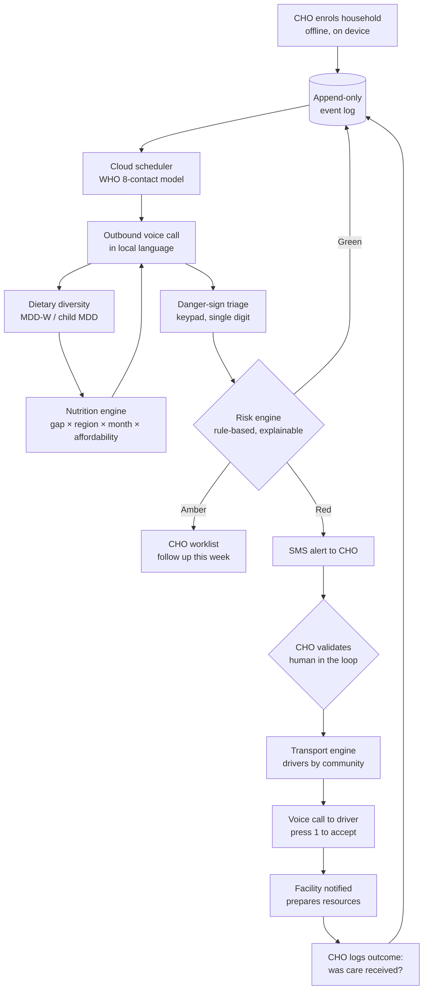

# Mabia AI

**CHPS Emergency Response, Voice Outreach and Nutrition Coordination Platform**

An offline-first voice platform that calls pregnant women and caregivers in their own language over plain GSM — triaging danger signs, measuring dietary diversity, and dispatching community transport — so that silence is never mistaken for safety.

Built for the **UNICEF StartUp Lab · AI for Nurturing Care Hackathon 2026**, for the Northern, North East, Savannah, Upper East and Upper West Regions of Ghana.

> **Mabia** is the name of the language family spoken across most of Northern Ghana — Dagbani, Kusaal, Frafra and their siblings. It means *mother's child*, from **ma** (mother) and **bia** (child).

---

## Run it

```bash
git clone https://github.com/NasamuAlhassan/Mabia-AI.git
cd Mabia-AI
./scripts/dev.sh
```

That is the whole setup. No Docker, no Postgres, no telephony account — SQLite and a built-in simulator cover all of it.

- **Web** → http://localhost:5173
- **API** → http://127.0.0.1:8000 (interactive docs at `/docs`)
- **Sign in** → `+233200000001` / PIN `1234` (development only; the sign-in screen shows these in dev mode and never in production)

```bash
./scripts/test.sh    # 150 tests
```

## Make it call a real phone

Everything operational is entered on the **Setup** screen in the browser, not in a config file — a CHPS deployment gets handed to people who will never open a terminal.

1. Open **Setup**.
2. Switch the provider to **Africa's Talking** and paste your API key and username.
3. Enter your **voice number** and **your own phone number** to test against.
4. Expose the API so Africa's Talking can call back:
   ```bash
   ngrok http 8000
   ```
   Paste the `https://…` URL into **Public callback URL**, and set the same URL as the voice callback on your number in the Africa's Talking dashboard.
5. Press **Place a test call**.

The Setup screen tells you what works right now and what is missing, in terms of what will actually go wrong. A missing callback URL doesn't say "field required" — it says the call will connect and then fall silent, which is what actually happens.

---

## Deploying

Two services. The web app is at **https://mabia-ai.vercel.app**, the API at **https://mabia-api.onrender.com**.

### Vercel — the web app

Root directory `frontend`. One environment variable:

| Variable | Value |
|---|---|
| `VITE_API_BASE` | `https://mabia-api.onrender.com` |

Leave it unset locally — Vite proxies `/api` to `127.0.0.1:8000`, so development needs no value at all.

### Render — the API

Root directory `backend`, from `render.yaml`:

| Variable | Value | Why |
|---|---|---|
| `CORS_ORIGINS` | `https://mabia-ai.vercel.app` | The web app's origin. Vercel preview URLs are allowed by pattern as well, so preview builds keep working. |
| `PUBLIC_BASE_URL` | `https://mabia-api.onrender.com` | Where Africa's Talking calls back during a call. Without it a call connects and then falls silent. |
| `JWT_SECRET` | generated | Sign-in tokens. |
| `SEED_ON_START` | `1` | Seeds the demo caseload into an empty database. |
| `PYTHON_VERSION` | `3.11` | |
| `DATABASE_URL` | *unset* | Unset means SQLite on the service's disk. See the note below. |

**On storage:** the API runs on SQLite by default, which on Render's free plan means the disk is wiped on every deploy and the demo caseload is re-seeded. That is right for a demo and wrong for a pilot. To keep data between deploys, uncomment the `databases` block and the `DATABASE_URL` entry in `render.yaml` — `psycopg2-binary` is already installed, and `config.py` handles the legacy `postgres://` scheme Render still hands out.

**Two things that will bite if you change them.** `allow_credentials` must stay `False` while `allow_origins` can be `*` — browsers reject that combination outright and every request fails with an opaque CORS error. And `DATABASE_URL` pointing at Postgres without `psycopg2` installed gives a `ModuleNotFoundError` several frames inside SQLAlchemy; `config.py` now catches that at startup and says what to do.

---

## The problem

Maternal mortality in Ghana stood at 234 per 100,000 live births in 2023, against an SDG target of under 70. Between 2019 and 2023 the Northern Region alone accounted for 10% of the country's neonatal deaths. Stunting reaches nearly 30% in the Northern and North East Regions, and only 26.4% of children aged 6–23 months receive a minimum acceptable diet.

These failures map onto the **Three Delays** (Thaddeus & Maine, 1994):

| Delay | What fails | What Mabia AI does |
|---|---|---|
| **1 — Deciding to seek care** | Helplines wait passively; they assume a woman already knows something is wrong | The system **calls her**, on a schedule anchored to her pregnancy |
| **2 — Reaching care** | Long distances, poor roads, almost no ambulances | Automated voice dispatch of community drivers, accepted by keypad |
| **3 — Receiving adequate care** | Facilities learn of a case as the patient arrives; referral completion is never confirmed | Facility notified ahead with the reasons; case stays open until the outcome is logged |

---

## How it works



A caregiver can also reach the platform at any time: she rings and hangs up, and the system **calls her back** — so reaching help never depends on having airtime at the moment of crisis. She can press **9** at any point to be routed to an on-call nurse. If nobody answers at any level of the cascade, the call still ends by telling her that her health worker has been alerted, and a RED is raised. **No call is permitted to end silently.**

---

## Six decisions worth knowing

**The event log is append-only because two writers act on the same patient by design** — the cloud scheduler writing call results, and the CHO recording a visit offline. Both append; neither overwrites, so a worker who syncs three days late cannot destroy data. Patient state and risk are *projections*, recomputed by folding the log, never stored as authoritative values.

**Ingest is idempotent on a client-generated id.** A worker on a failing 3G link can retry the same batch forever and the result is identical. This one property removes most sync bugs, and it is why enrolment generates its id on the device.

**SMS pushes, USSD pulls.** A USSD session can only be started by the person holding the handset, so it cannot be used to alert anyone. SMS carries the interrupt; USSD is how a CHO pulls her worklist with no mobile data at all.

**Nutrition advice is filtered by what she can actually get.** Northern Ghana has one rainy season, so May–August is a lean period when advice to *buy* food is not advice. In that window the engine shifts to gathered and stored foods — dried fish powder, groundnut paste, dawadawa, and baobab leaf and moringa, which grow locally and cost nothing. MDD-W (ten groups, women) and the child indicator (eight, including breast milk) are kept separate throughout and never conflated.

**The AI recommends; it never decides.** Every classification carries structured reason codes rendered in the worker's language, every escalation passes a named human, and every case is closed by a person. The engine is deterministic and auditable — the event log is shaped so models can be trained later, rather than claiming prediction without data.

**Speech is an enhancement layer, not a dependency.** The keypad path is complete and standalone. TTS for Dagbani, Kusaal and Frafra rides on top, via Khaya where its quota allows and Meta's MMS locally where a model exists — which today is Kusaal and nothing else here. Gonja has neither, and was always going to need a human voice. Nothing has been trained or fine-tuned: narrowband augmentation to match 8 kHz telephone audio is the right next step and is not yet done. Recorded prompts drop into `backend/audio/<language>/` and are picked up automatically; anything missing falls back to spoken English so the flow is always testable.

---

## Stack

| Layer | Technology |
|---|---|
| Frontend | React, Vite, PWA, IndexedDB |
| Backend | Python, FastAPI, SQLAlchemy |
| Database | SQLite locally, PostgreSQL in the cloud |
| Intelligence | Deterministic rule engine; seasonal food model |
| Communications | Africa's Talking Voice, SMS, USSD — or the built-in simulator |
| Deploy | Render (API) + Vercel (web) |

## Layout

```
backend/
  app/
    events.py          the append-only log and the fold
    engines/risk.py    Green / Amber / Red with reason codes
    engines/nutrition.py   gap × region × month × affordability
    data/foods.py      the seasonal food table for Northern Ghana
    telephony/ivr.py   the call state machine
    telephony/africastalking.py  |  telephony/simulator.py
    services.py        emergencies, dispatch, nurse cascade, no dead ends
    api/               routes, incl. the voice and USSD webhooks
  tests/               150 tests
  audio/<language>/    recorded prompts, served publicly
frontend/src/pages/    Setup, Worklist, Patient, Enrol, Calls, Nutrition, …
scripts/               dev.sh, test.sh
```

---

## What the tests actually check

Not coverage — the specific claims that would be embarrassing to have broken in
front of a judge. Several of these exist because a review broke the earlier
version live:

- A **DTMF timeout is never recorded as a denial**. A woman too weak or
  unfamiliar with a keypad to press anything used to be written down as having
  denied bleeding
- **Pressing 9 for a nurse keeps** everything she just reported
- A **late keypress does not re-fold the call** into the log and manufacture a
  clinical finding from one call
- A **driver whose phone is off advances the queue** instead of stranding the
  emergency
- **Two drivers cannot both accept**; double-tapping Confirm does not dispatch twice
- An **enrolment queued offline becomes a real patient**, and pushing it twice
  enrols one woman
- A **queued visit keeps the arm measurement**, the iron answer and the note
- A **late sync does not overwrite a newer reading**
- A **RED stays RED** until a human records the outcome
- **Distance escalates a symptom but not a missed tablet** — a poor road must
  not dispatch a vehicle at night because someone skipped iron
- **Advice rotates through her gaps** rather than repeating one sentence for a year
- **MDD-W is ten groups, the child indicator is eight**, and they never mix
- The **catalogue covers every line the platform says**, so a new danger sign
  cannot escape translation
- A **recorded human voice is never overwritten** by a generated one

## Status

Honest about the difference between built, partly built, and not built. An
earlier version of this table listed things as working that had no trigger, read
columns that did not exist, or lived in an empty directory — so this one is
written to be checkable.

| Component | Status |
|---|---|
| Append-only event log, idempotent sync, projections | **Working** |
| Risk engine with reason codes, human-in-the-loop | **Working** |
| Nutrition engine: gap-first, seasonal, affordability-aware | **Working** |
| IVR state machine, keypad triage, press-9 to a nurse | **Working** |
| Inbound hotline, flash-to-callback, nurse cascade, no dead ends | **Working** |
| Emergency validation, driver cascade, outcome logging | **Working** |
| CHO worklist, enrolment, visit recording, facility board | **Working** |
| Outreach scheduler (run-due endpoint + daily cron) | **Working** |
| Khaya translation: Dagbani, 72/83 lines | **Working**, shipped in the repo. 11 stale after the English was rewritten — kept and flagged, not deleted |
| Khaya translation: Kusaal 18/83, Frafra 0/83 | **Blocked** — free-tier quota, replenishes mid-August |
| Khaya translation: Gonja | **Not possible** — no model exists; Gonja is Guang, not Mabia |
| Local-language *audio* | **Partly.** Kusaal 17/45 core lines via Meta MMS running locally; Dagbani 2/45. Khaya's TTS is down upstream and has no Dagbani model regardless. Anything unrecorded plays English |
| Speech recognition | **Not started.** The keypad path is complete and stands alone |
| USSD worklist retrieval | Built; needs a live shared code to dial |
| Predictive models, DHIMS2 integration | Roadmap, and deliberately so — see below |

**On the audio, plainly:** the platform has real Dagbani *wording* and almost no
Dagbani *voice* — two recordings against the forty-five lines every outreach call
plays. Khaya translates correctly and its speech service returns an unavailable
page; Meta's MMS runs locally and has a model for Kusaal and for none of the
other three. So today most of a call is English, and the Voice screen says so
rather than showing a green tick.

The fallback is deliberate, and getting it wrong taught us something worth
writing down. `<Say>` is the provider's **English** text-to-speech voice; there
is no Dagbani, Kusaal, Frafra or Gonja voice behind it. An early build handed it
the Dagbani translation, reasoning that her language beats English. It does not:
what comes out is an English speaker failing at Dagbani orthography, which is
less use to the woman on the line than plain English. The rule is now explicit
and tested — a recording in her language is **played**, and anything without one
is **said** in English until a recording exists. The translation is what we
record and what we display. It is never what we speak.

That is also why coverage is reported as two numbers. The whole catalogue
includes thirty-four food messages of which a call plays one, and eight
next-visit intervals of which it plays one; averaging those with the greeting
every call opens with produces a figure that means nothing. The badge shows the
share of the lines every call actually walks through, and the fix for it is
either Khaya returning or a speaker sitting down with the recording list — which
the app generates, in priority order, and can record into directly.

**On the AI, plainly:** the triage and nutrition engines are deterministic rule
engines, not models. That is a choice, not a gap. A rule that fires because a
woman reported bleeding can be read, argued with and overruled by a health
worker; a model trained on data that does not yet exist cannot. The event log is
shaped so models can be trained once real programme data accumulates. Claiming
prediction today would be the easy thing and the wrong one.

## Team

| Member | Role |
|---|---|
| **Prince Nasamu Alhassan** | Engineering and AI lead — backend, speech models, risk and nutrition engines. University of Ghana, Legon (Mathematical Science with Computer Science) |
| **Joshua Akum Winyelsum** | Full-stack and design — CHPS Progressive Web App and interface. University for Development Studies, Tamale (Computer Science) |
| **Dawuda Mardia** | Nutrition and community research — owns the local-food model: seasonal availability, affordability, food groups and cultural food taboos. University for Development Studies, Tamale (Food and Nutrition) |

---

## Acknowledgements

Built for the KOICA–UNICEF Accelerating Entrepreneurship and Innovation in Ghana Project, UNICEF StartUp Lab.

Mabia AI does not replace national health information systems. It captures the out-of-facility community contacts that those systems structurally cannot see.
